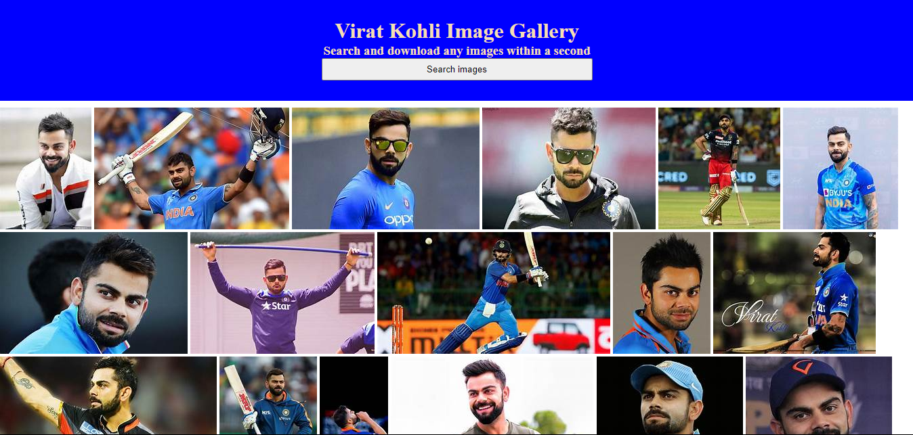

# Hi, I'm Harsh Mishra! 👋

## 🚀 I'm a full-stack developer...

## Project Title - 
### Virat Kohli Photo Gallery

Welcome to the Virat Kohli Photo Gallery! This web application is dedicated to showcasing the remarkable career of one of the greatest cricketers of all time, Virat Kohli. The gallery features a curated collection of images highlighting memorable moments from his career, personal life, and achievements.

## Features:

+ **Image Gallery**: A dynamic, well-organized gallery displaying high-quality images of Virat Kohli.
+ **Categories:** Photos categorized based on Virat's career phases, personal life, and on-field highlights.
+ **Responsive Design:** Fully responsive and mobile-friendly design to ensure a seamless experience across all devices.
+ **Interactive UI:** User-friendly interface with hover effects and smooth transitions.
+ **Photo Details:** Each image includes captions and descriptions for more context.

## Average time to complete
 1 hrs

## Technology Used

## 🛠 Skills
HTML, CSS

## Demo | Netlify
https://gentle-cobbler-e5d2da.netlify.app/

## Screenshots

## 🤝 Contributing

Contributions are welcome! If you'd like to improve this project, feel free to submit a pull request or open an issue for discussion.

## 📫 Contact
For any questions or feedback, reach out via:

**Email:** hm45676777776@gmail.com

**GitHub:** HarshMishra23

